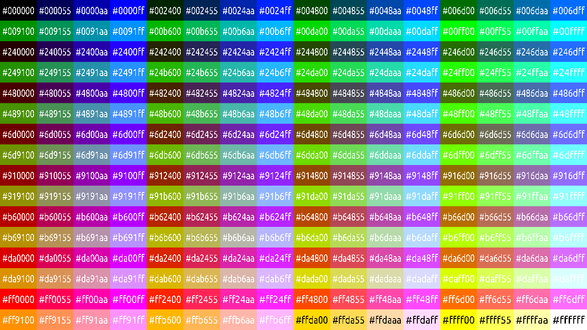

# 8 bit Colors in HTML form

## Description

The RRRGGGBB colors with their HTML 24-bit color codes.
A program that generates them and shows it as an image

## The 8-bit Colors

## How to Build

First you'll need to install the SDL2 and SDL2_ttf libraries and add them to your path.

On Arch you can do:
`sudo pacman -S sdl2 sdl2_ttf`

I believe (may be wrong) on Debian/Ubuntu you can do:
`sudo apt install -y libsdl2-dev libsdl2_ttf-dev build-essential`

On Windows it's much more of a process because it sucks, so you'll have to figure it out on your own if you want to build with MinGW or whatever

No clue on Mac, sorry

Afterwards just run `make` and run the program with `./colors` (or `./colors.exe` if on Windows)

It just makes the picture, so you don't really need to build
